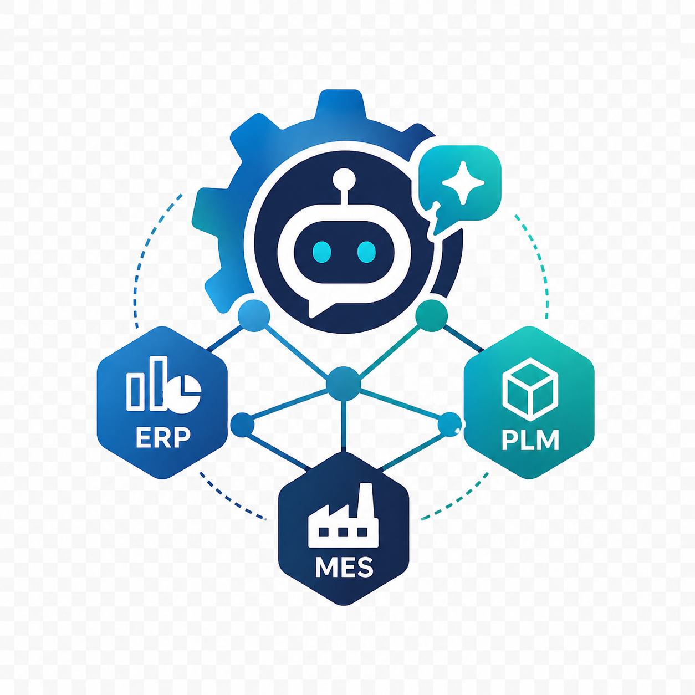

# ERP/PLM/MES GraphRAG Agent

<p align="center">
  
</p>

> A manufacturing GraphRAG + LangGraph Agent PoC for integrated ERP/PLM/MES data search, analysis, and evidence-based response generation.

본 프로젝트는 제조업 ERP/PLM/MES 데이터를 통합 조회·분석하기 위한 **GraphRAG + Agentic AI 챗봇 PoC**입니다.
제품, 부품, BOM, 공정, 설비, LOT, 불량, 설계변경 간 관계를 지식 그래프로 모델링하고,
LangGraph Supervisor Agent가 사용자 질문에 따라 ERP/PLM/MES/Neo4j/SPARQL Tool을 선택 호출합니다.

> 본 레포지토리는 GitHub 포트폴리오용으로, 실제 고객 데이터 없이 **synthetic manufacturing dataset**을 사용합니다.

---

## 1. Project Summary

- **목표**: 제조업 ERP/PLM/MES 데이터를 통합 조회·분석하는 GraphRAG + Agentic AI 챗봇을 PoC 수준으로 구현한다.
- **배경**: ERP/PLM/MES는 시스템·DB·기준정보가 분리되어 있어, 단일 LLM 챗봇으로는 “BOM ↔ LOT ↔ 공정 ↔ 설비 ↔ 불량 ↔ 설계변경”의 관계 기반 분석이 어렵다.
- **접근**: SQL Tool / Neo4j Graph Tool / SPARQL Tool / RAG Tool을 LangGraph Supervisor Agent가 라우팅하여, **evidence-based 답변**을 생성한다.
- **포지셔닝**: 단순 LLM 챗봇이 아니라, 도메인 모델링 → 데이터 통합 → Agent 설계 → 보안/권한/HITL까지 PL 관점에서 설계 가능한 역량을 보여준다.

---

## 2. Why This Project

제조업 현장에서 흔한 문제:

- A제품 불량률이 갑자기 올라갔는데 ERP, PLM, MES 화면을 모두 열어가며 원인을 추적해야 한다.
- 설계변경(ECO)이 실제 LOT 투입에 반영되었는지 확인하려면 시스템 3개를 비교해야 한다.
- 공급사 변경 이슈가 어떤 제품에 영향을 미치는지 즉시 답하기 어렵다.

해결 가설:

- 시스템 간 관계를 Knowledge Graph로 표현한다.
- LLM이 직접 SQL을 실행하지 않고 Tool을 통해 read-only로 데이터에 접근한다.
- 답변은 항상 evidence(record_id, source)를 포함한다.
- 운영 시스템 write 작업은 Human-in-the-loop 승인 후에만 이루어진다.

---

## 3. Architecture

```text
[User]
   ↓
[Frontend: React + Vite + TypeScript]
   ↓ (REST)
[FastAPI Backend]
   ↓
[LangGraph Supervisor Agent]
   ├─ Intent Classifier Node
   ├─ Data Source Router Node
   ├─ ERP Agent Node      → SQL Tool (synthetic ERP DB)
   ├─ PLM Agent Node      → SQL Tool (synthetic PLM DB)
   ├─ MES Agent Node      → SQL Tool (synthetic MES DB)
   ├─ Knowledge Graph Node → Neo4j Tool
   ├─ SPARQL Node         → RDF/OWL ontology
   ├─ Analysis Node
   └─ Response Generator  → LLM Provider (Gemini / OpenAI-compatible)
   ↓
[Evidence-based Answer]
```

> LLM 호출부를 Agent 코드와 분리하여, 초기에는 **Gemini API**를 사용하고,
> Phase 2에는 **vLLM / Ollama / TGI 기반 자체 오픈소스 LLM**으로 쉽게 교체할 수 있도록 설계했습니다.

자세한 내용은 [`docs/03_system_architecture.md`](docs/03_system_architecture.md) 참고.

---

## 4. Features

- **ERP/PLM/MES 통합 조회**: 재고, BOM, 생산실적, 불량, 설계변경, 공급사 정보를 단일 챗봇에서 조회
- **GraphRAG**: Neo4j 지식 그래프로 제품-부품-공정-설비-불량 관계 탐색
- **Ontology-based 질의**: RDF/OWL ontology + SPARQL 샘플 쿼리
- **Evidence-based answer**: 모든 답변에 `source / record_id / description` 포함
- **HITL Policy**: 운영 시스템 write 작업은 자동 실행하지 않고 승인 요청 메시지 생성
- **LLM Provider 추상화**: Gemini ↔ OpenAI-compatible (vLLM/Ollama/TGI/LM Studio) 교체 가능
- **PL 관점 문서화**: 요구사항 → 기술 태스크 변환, Phase Plan, 보안 정책, 고객 미팅 체크리스트

---

## 5. Demo Questions

PoC가 처리하는 대표 질문:

1. **품질 원인 분석**
   - "A제품의 최근 3개월 불량률이 상승한 원인을 분석해줘."
2. **BOM 불일치 탐지**
   - "PLM BOM과 MES 실제 투입 부품이 다른 LOT를 찾아줘."
3. **공급사 영향도 분석**
   - "공급사 S-03의 부품이 들어간 제품과 최근 품질 이슈를 요약해줘."
4. **설계변경 영향도 분석**
   - "최근 설계변경이 있었던 제품 중 불량률이 증가한 제품을 찾아줘."
5. **제품 통합 요약**
   - "A제품의 BOM, 재고, 생산실적, 불량률을 통합 요약해줘."

각 질문이 어떤 Agent / Tool을 호출하는지는 [`docs/04_agent_workflow.md`](docs/04_agent_workflow.md) 참고.

---

## 6. Tech Stack

| Layer | Stack |
|---|---|
| Backend | Python 3.11+, FastAPI, Pydantic, SQLAlchemy, uv |
| Agent | LangGraph, LangChain |
| LLM | Gemini API (Phase 1), OpenAI-compatible (Phase 2: vLLM/Ollama/TGI) |
| Knowledge Graph | Neo4j 5.x, Cypher |
| Ontology | RDF/OWL (Turtle), SPARQL via rdflib |
| Storage | SQLite (synthetic ERP/PLM/MES DB) |
| Frontend | React, TypeScript, Vite, Tailwind CSS |
| DevOps | Docker Compose, ruff, mypy, pytest |

---

## 7. Repository Structure

```text
erp-plm-mes-graphrag-agent/
 ├─ backend/         # FastAPI + LangGraph Agent + Tools + LLM Provider
 ├─ frontend/        # React + Vite Chat UI
 ├─ data/            # synthetic ERP/PLM/MES CSV + generator
 ├─ graph/           # Neo4j cypher schema, constraints, sample queries
 ├─ ontology/        # manufacturing.ttl + sample SPARQL
 ├─ docs/            # PL 관점 문서 (overview, architecture, security, phase plan, ...)
 ├─ docker-compose.yml
 ├─ .env.example
 ├─ README.md
 └─ CLAUDE.md
```

각 디렉터리의 역할은 [`docs/03_system_architecture.md`](docs/03_system_architecture.md)에서 상세히 설명.

---

## 8. How to Run

### 8.1 사전 준비

```bash
cp .env.example .env
# .env의 GEMINI_API_KEY 등 채우기
```

### 8.2 Synthetic Data 생성

```bash
cd backend
uv sync
uv run python ../data/generate_synthetic_data.py
```

### 8.3 Docker Compose로 한 번에 실행

```bash
docker compose up --build
```

| URL | 용도 |
|---|---|
| http://localhost:5173 | Frontend (Chat UI) |
| http://localhost:8000/docs | Backend Swagger |
| http://localhost:7474 | Neo4j Browser |

### 8.4 로컬 개발 (Docker 없이)

```bash
# backend
cd backend
uv sync
uv run uvicorn app.main:app --reload

# frontend
cd frontend
npm install
npm run dev
```

---

## 9. Example Responses

`POST /chat` 응답 예시 (Use Case 1 — 품질 원인 분석):

```json
{
  "answer": "A제품의 불량률은 2026년 2월 1.8%에서 2026년 4월 4.9%로 증가했습니다. 증가 구간은 LOT-L24041 이후이며, 해당 LOT부터 부품 P-203의 공급사가 S-02에서 S-07로 변경되었습니다. ...",
  "intent": "quality_root_cause_analysis",
  "used_sources": ["MES", "PLM", "ERP", "Neo4j"],
  "evidence": [
    {
      "source": "MES.production_results",
      "record_id": "RESULT-001",
      "description": "2026-04 A제품 불량률 4.9%"
    },
    {
      "source": "PLM.eco",
      "record_id": "ECO-2026-014",
      "description": "외장 케이스 변경 승인"
    }
  ],
  "limitations": [
    "Synthetic dataset 기반 분석이므로 실제 운영 데이터와 다를 수 있음"
  ]
}
```

응답 원칙:

- 근거 없는 단정 금지
- 원인 분석은 “후보”로 표현
- 데이터 출처와 record_id 명시
- Synthetic data임을 명확히 표시

---

## 10. Documentation

포트폴리오의 주요 내용을 문서로 요약한 내용입니다.

| 문서 | 내용 |
|---|---|
| [`docs/01_project_overview.md`](docs/01_project_overview.md) | 프로젝트 배경, 문제정의, MVP 범위 |
| [`docs/02_requirements_to_tasks.md`](docs/02_requirements_to_tasks.md) | 현업 요구 → 기술 태스크 변환 예시 |
| [`docs/03_system_architecture.md`](docs/03_system_architecture.md) | 전체 아키텍처와 데이터 흐름 |
| [`docs/04_agent_workflow.md`](docs/04_agent_workflow.md) | LangGraph State, Node, Routing, HITL |
| [`docs/05_data_model_erp_plm_mes.md`](docs/05_data_model_erp_plm_mes.md) | ERP/PLM/MES 테이블·컬럼·키 매핑 |
| [`docs/06_knowledge_graph_schema.md`](docs/06_knowledge_graph_schema.md) | Neo4j 노드/관계/Cypher |
| [`docs/07_security_and_permission.md`](docs/07_security_and_permission.md) | 읽기 전용, 마스킹, audit log, HITL |


---

## 11. Security Design

초기 MVP 보안 원칙 (자세한 내용 [`docs/07_security_and_permission.md`](docs/07_security_and_permission.md)):

1. 모든 데이터는 synthetic data 사용
2. 모든 Tool은 read-only 기본값
3. SQL safety check 필수 (SELECT만 허용)
4. 운영 시스템 write 작업 금지
5. 민감 데이터 마스킹
6. Agent trace와 tool call log 저장
7. Human-in-the-loop 승인 정책 문서화
8. `.env` 파일 커밋 금지, API Key는 placeholder만 제공

## License

Portfolio repository — 자유롭게 참고 가능. 실제 고객 데이터는 포함하지 않으며, 모든 데이터는 synthetic.
